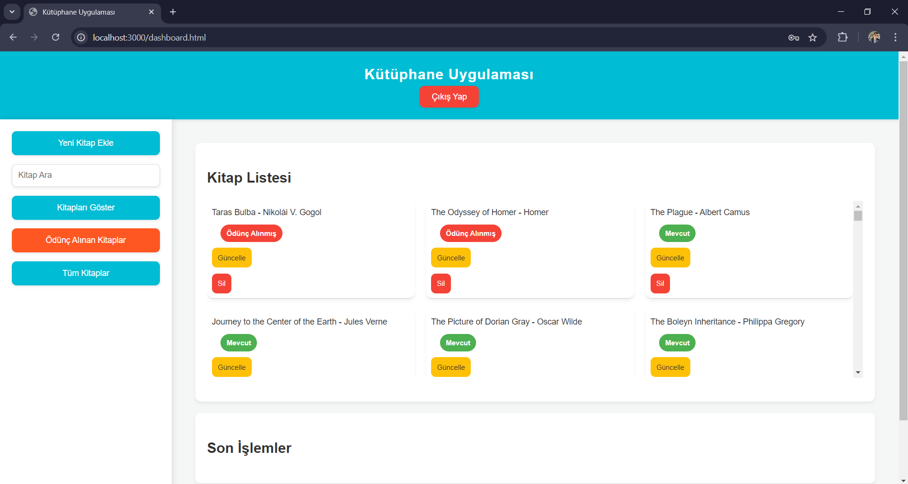

# 📚 Library App

**Library App** is a modern, full-featured web application developed during my internship to manage books in a user-friendly and efficient way. Users can list, search, add, delete, and borrow books easily. The app also supports real-time notifications for a seamless experience.

## ⚙️ Features

- 📖 List all books  
- 🔍 Search books by name or author  
- ➕ Add new books  
- 🗑️ Delete books by name  
- 📦 Borrow books (with user-specific tracking)  
- 🔔 Real-time notifications using WebSocket  
- 👤 Login / Sign Up / Logout system with password encryption  
- 🎨 Clean, modern UI with sidebar navigation  

## 🛠️ Tech Stack

- **Frontend:** HTML, CSS, JavaScript (Vanilla)  
- **Backend:** Node.js, Express.js  
- **Database:** MySQL  
- **Real-time:** WebSocket  
- **Security:** bcrypt for password encryption  

## 🚀 Setup Instructions

1. Clone the repository:

```
git clone https://github.com/mexmettat/library-app.git
cd library-app
```

2. Install dependencies:

```
npm install
```

3. Create a `.env` file and add your database configuration:

```
DB_HOST=localhost
DB_USER=your_mysql_username
DB_PASS=your_mysql_password
DB_NAME=library_app
```

4. Create the database in MySQL:

```
CREATE DATABASE library_app;
```

5. Run the `Local instance MySQL90.session.sql` script to set up the tables.

6. Start the server:

```
npm start
```

7. Open the app in your browser:  
[http://localhost:3000](http://localhost:3000)

## 📡 Real-Time Notifications

The app uses WebSocket to deliver real-time notifications when new books are added. This allows all connected users to receive updates without refreshing the page.

## 🔐 Authentication

- Users can register and log in securely.  
- Passwords are hashed using **bcrypt** before storing in the database.  
- Sessions are managed upon successful login.

## 📁 Project Structure

```
library-app/
├── public/
│   ├── index.html
│   ├── style.css
│   └── fetchBooks.js
├── server.js
├── package.json
└── Local instance MySQL90.session.sql
```

## 💡 Future Improvements

- 📚 Book return functionality  
- 👮 Role-based access control (admin/user)  
- 🧾 API documentation (Swagger/OpenAPI)  
- 🐳 Docker support for simplified deployment  

## 🧩 Challenges Faced

- Managing form states after updates  
- Implementing and testing WebSocket events  
- Creating a clean, user-friendly interface  
- Securing user authentication and sessions

## 📸 Screenshots

Below are some screenshots from the Library Management System:

- **Main Screen**  
    
  The main dashboard of the application. Users can access all key features from here.

- **Login Screen**  
    
  The screen where users log into the system with secure authentication.

- **Update Section**  
    
  Used to edit and update information about existing books.

- **Book Storage Section**  
    
  Displays all stored books and allows for management operations.

- **Recent Actions Section**  
    
  Shows the most recent activities in the system, such as borrowing or editing books.

- **Add New Book Section**  
    
  A form to add new books to the system.

- **Borrowed Books**  
    
  Displays the list of books currently borrowed by users.

- **Sign Up Screen**  
    
  Allows new users to register for an account.


## 👨‍💻 Developer

**Mehmet Tat**  
GitHub: [@mexmettat](https://github.com/mexmettat)

---

📝 This project was developed during my internship as a learning and training experience. Contributions and suggestions are always welcome!
